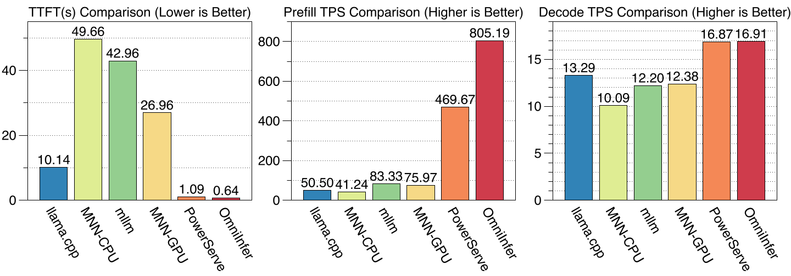

<p align="center">
  <picture>
    
  </picture>
</p>

<h3 align="center">
High-Performance, On-Device VLM Inference with Hybrid NPU Acceleration
</h3>

<p align="center">
| 
<a href="#android-demo--architecture"><b>Demo</b></a> 
| 
<a href="#Performance"><b>Performance</b></a> 
| 
<a href="#supported-models"><b>Models</b></a> 
| 
<a href="#quick-start"><b>Quick Start</b></a> 
| 
<a href="https://github.com/omnimind-ai/OmniInfer-LLM/issues"><b>Issues</b></a> 
|
</p>

**OmniInfer-LLM** is the **central orchestrator repository** for deploying **end-to-end Visual Language Model (VLM)** inference on mobile devices using a **hybrid NPU acceleration strategy**.

This repository ties together:

- **OmniInfer-VLM** — vision encoder (ViT) inference via a custom **llama.cpp NPU backend**
- **ExecuTorch-based LLM inference** — language decoder with NPU acceleration
- **OmniOp-NPU** — shared **NPU operator library** used by OmniInfer-VLM runtimes

Together, these form a complete pipeline for running models such as **Qwen2.5-VL** on-device with both image and text understanding.

------

## Android Demo & Architecture

Below are two examples of running OmniInfer-LLM as a chatbot on the OnePlus Ace5 Pro.

<table width="100%">
  <tr>
    <td width="50%">
      <video src="https://github.com/user-attachments/assets/27dae1ca-294a-4157-96ae-522377587777" controls="controls" style="max-width: 100%;"></video>
    </td>
    <td width="50%">
      <video src="https://github.com/user-attachments/assets/57556ed0-5a22-48cf-a68b-42e85a91fdfa" controls="controls" style="max-width: 100%;"></video>
    </td>
  </tr>
</table>

Vision-Language Models consist of two major components:

1. **Vision Encoder (ViT)**
   - Processes images of **variable shapes and resolutions**
   - Requires flexibility that typical static backends cannot provide
2. **Language Decoder (LLM)**
   - Generates text based on both visual features and text input
   - Benefits from high-throughput NPU-accelerated autoregressive decoding

To balance these needs effectively, OmniInfer-LLM uses:

- **OmniInfer-VLM** (ViT via **llama.cpp + custom NPU backend**)
- **ExecuTorch NPU backend** for LLM decoding
- **OmniOp-NPU** shared library of optimized NPU operators

This hybrid approach enables efficient, production-ready VLM inference on real mobile devices.

------

## Performance Comparison

OmniInfer-LLM sets a new benchmark for on-device VLM inference. Compared to existing frameworks like llama.cpp, MNN, and PowerServe, OmniInfer provides significant advantages in latency and throughput.

<p align="center">
  <picture>
    
  </picture>
</p>

------

## Repositories & Responsibilities

### OmniInfer-LLM (this repository)

**Purpose:**
The integration layer that connects vision and language inference:

- Defines the end-to-end VLM execution flow
- Coordinates model inputs/outputs between ViT and LLM
- Provides configuration and orchestration for full VLM deployment
- Contains documentation and usage patterns for real-world inference

------

### OmniInfer-VLM

**Purpose:**
Vision encoder (ViT) inference powered by a **custom llama.cpp NPU backend**.

Responsibilities:

- Builds and runs ViT graphs (image → visual embeddings)
- Supports **variable input image sizes / aspect ratios**
- Includes Android / Linux support with NPU acceleration
- Contains all llama.cpp-specific build scripts and tooling

------

### OmniOp-NPU

**Purpose:**
Common NPU operator library and backend support.

Responsibilities:

- Implements NPU-optimized kernels & runtime interfaces

------

## End-to-End Pipeline

```
Input: Image + Text Prompt
           │
           ▼
[OmniInfer-VLM]
ViT encoding (llama.cpp with NPU)
           │
           ▼
Visual Embeddings
           │
           ▼
[OmniInfer-LLM]
LLM decoding (ExecuTorch with NPU)
           │
           ▼
Output: Generated Text
```

- Vision encoder runs first
- Generates feature embeddings
- Feeding into LLM for text generation
- All accelerated on device NPU when available

------

## Supported Models

### ✅Currently (Verified)

- **Qwen2.5-VL**

### 🚧In Progress

- **Qwen3-VL** and derived variants

------

## Quick Start

### Step 1:

Follow [omnimind-ai/OmniInfer-VLM](https://github.com/omnimind-ai/OmniInfer-VLM) to generate `mtmd_data.bin`

### Step 2:

1. Follow the [tutorial](https://pytorch.org/executorch/main/getting-started-setup) to set up ExecuTorch.
2. Follow the [tutorial](https://pytorch.org/executorch/main/backends-qualcomm) to build Qualcomm AI Engine Direct Backend.
3. Please install the llm eval dependency via `examples/models/llama/install_requirements.sh`

### Step 3:

Prepare Model (Qwen2.5 VL)

```
python examples/qualcomm/oss_scripts/llama/llama.py -b build-android -s ${SERIAL_NUM} -m ${SOC_MODEL} --prompt "How are you?" --temperature 0 --model_mode hybrid --prefill_ar_len 128 --max_seq_len 2048 --decoder_model qwen2_5_vl_3b  --artifact ./qwen_qnn
```

It will automatically push the model to the device and run it. But please make sure to place the previously generated `mtmd_data.bin` in the corresponding path first. You can also prepare the files manually and run them yourself.

```
adb shell
cd /data/local/tmp/${username}/executorch/single_llama
./qnn_llama_runner --decoder_model_version qwen2_5 --tokenizer_path tokenizer.json --model_path hybrid_llama_qnn.pte --seq_len 2048 --output_path outputs/outputs.txt --kv_updater SmartMask --eval_mode 1 --embeds_path mtmd_data.bin
```

------

## Why Hybrid Design?

| Requirement            | Single Engine | OmniInfer Hybrid     |
| ---------------------- | ------------- | -------------------- |
| Variable image input   | ❌             | ✅ (llama.cpp ViT)    |
| Efficient LLM decoding | ❌             | ✅ (ExecuTorch NPU)   |
| Unified inference      | ❌             | ⚡️ Balanced execution |
| On-device production   | ⚠️             | ✅                    |

This strategy avoids forcing one runtime to do everything sub-optimally, resulting in better performance and broader model support.

------

## License and Acknowledgements

This project is licensed under the Apache License, Version 2.0.

This repository contains code derived from the following open-source project:

- [ExecuTorch](https://github.com/pytorch/executorch)(BSD License)

------

## Contact Us

If you have any questions, feedback, or would like to join our community, please feel free to reach out.

<table align="center">
  <tr>
    <td align="center">
      <br/>
      <b>WeChat Group</b>
    </td>
    <td align="center">
       <a href="https://github.com/omnimind-ai/OmniInfer-LLM/issues">
        
      </a><br/>
      <b>Technical Support</b>
    </td>
  </tr>
</table>

---
